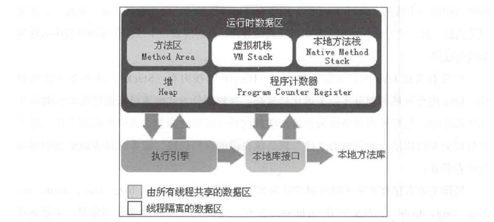

## 运行时数据区
Java虚拟机在执行Java程序的过程中会把它所管理的内存划分为若干个不同的数据区域。这些区域都有各自的用途，以及创建和销毁的时间，有的区域随着虚拟机进程的启动而存在，有些区域则依赖用户线程的启动和结束而建立和销毁。Java 虚拟机所管理的内存将会包括以下几个运行时数据区域，如图所示。

### 程序计数器
程序计数器(Program Counter Register)是一块较小的内存空间，它可以看作是当前线程所执行的字节码的行号指示器。在虚拟机的概念模型里(仅是概念模型，各种虚拟机可能会通过一些更高效的方式去实现)，字节码解释器工作时就是通过改变这个计数器的值来选取下一条需要执行的字节码指令，分支、循环、跳转、异常处理、线程恢复等基础功能都需要依赖这个计数器来完成。

由于Java虚拟机的多线程是通过线程轮流切换并分配处理器执行时间的方式来实现的，在任何一个确定的时刻，一个处理器(对于多核处理器来说是一个内核）都只会执行一条线程中的指令。因此，为了线程切换后能恢复到正确的执行位置，每条线程都需要有一个独立的程序计数器，各条线程之间计数器互不影响，独立存储，我们称这类内存区域为“线程私有”的内存。

### Java虚拟机栈
Java虚拟机栈(Java Virtual Machine Stacks)也是线程私有的，它的生命周期与线程相同。虚拟机栈描述的是Java方法执行的内存模型: 每个方法在执行的同时都会创建一个栈帧(Stack Frame) 用于存储局部变量表、操作数栈、动态链接、方法出口等信息。每一个方法从调用直至执行完成的过程，就对应着一个栈帧在虚拟机栈中入栈到出栈的过程。

局部变量表存放了编译期可知的各种基本数据类型(boolean、byte、char、 short、int、float、long、double)、对象引用(reference 类型，它不等同于对象本身，可能是一个指向对象起始地址的引用指针，也可能是指向一个代表对象的句柄或其他与此对象相关的位置)和returnAddress类型(指向了一条字节码指令的地址)。

### 本地方法栈
本地方法栈(Native Method Stack)与虚拟机械所发挥的作用是非常相似的，它们之间的区别不过是虚拟机械为虚拟机执行Java方法(也就是字节码)服务，而本地方法战则为虚拟机使用到的Native方法服务。

### Java堆
对于大多数应用来说，Java堆(Java Heap)是Java虚拟机所管理的内存中最大的一块。Java堆是被所有线程共享的一块内存区域，在虚拟机启动时创建。此内存区域的唯一目的就是存放对象实例，几乎所有的对象实例都在这里分配内存。

Java堆是垃圾收集器管理的主要区域，因此很多时候也被称做“GC堆”(Garbage Collected Heap)。从内存回收的角度来看，由于现在收集器基本都采用分代收集算法，所以Java堆中还可以细分为: 新生代和老年代; 再细致一点的有Eden空间、From Survivor空间、To Survivor空间等。从内存分配的角度来看，线程共享的Java堆中可能划分出多个线程私有的分配缓冲区(Thread Local Allocation Buffer, TLAB)。不过无论如何划分，都与存放内容无关，无论哪个区域，存储的都仍然是对象实例，进一步划分的目的是为了更好地回收内存，或者更快地分配内存。

### 方法区(Method Area)
方法区(Method Area)与Java堆一样，是各个线程共享的内存区域，它用于存储已被虚拟机加载的类信息、常量、静态变量、即时编译器编译后的代码等数据。

### 运行时常量池
运行时常量池(Runtime Constant Pool)是方法区的一部分。Class文件中除了有类的版本、字段、方法、接口等描述信息外，还有一项信息是常量池(Constant Pool Table)，用于存放编译期生成的各种字面量和符号引用，这部分内容将在类加载后进入方法区的运行时常量池中存放。

