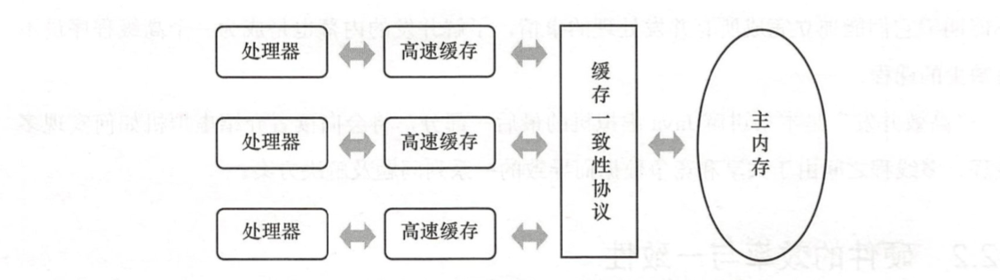
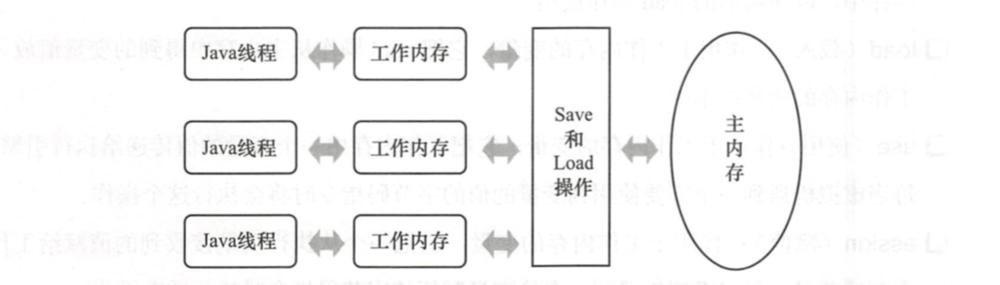

Java虚拟机规范中试图定义一种Java内存模型来屏蔽掉各种硬件和操作系统的内存访问差异，以实现让Java程序在各种平台下都能达到一致的内存访问效果。

## 硬件的效率与一致性
“让计算机并发的执行某个任务”与“更充分的利用计算机的效能”之间的关系，并不是通常想象的那么简单，其中一个重要的复杂性来源是绝大多数的运算任务并不能只靠处理器“计算”就能完成。处理器至少要与内存交互，如读取运算数据，存储运算结果等，这个IO操作是很难消除的。由于计算机的存储设备与处理器的运算速度有几个数量级的差距，所以现代计算机系统不得不加入一层读写速度尽可能接近处理器运算速度的高速缓存(Cache)来作为内存与处理器之间的缓冲: 将运算需要使用到的数据复制到缓存中，让运算能快速进行，当运算结束后再从缓存同步回内存之中，这样处理器就无需等待稍慢的内存读写了。

基于高速缓存的存储交互很好地解决了处理器与 内存的速度矛盾，但是也为计算机系统 带来更高的复杂度，因为它引入了一个新的问题 : 缓存一致性( Cache Coherence)。在多处 理器系统中，每个处理器都有自己的高速缓存，而它们又共享同一主内存(Main Memory), 如图所示。

当多个处理器的运算任务都涉及同一块主内存区域时，将可能导致各自的 缓存数据不一致，如果真的发生这种情况，那同步回到主内存时以谁的缓存数据为准呢?为 了解决一致性的问题，需要各个处理器访问缓存时都遵循一些协议，在读写时要根据协议来进行操作，这类协议有 MSI、 MESI (Illinois Protocol)等 。

除了增加高速缓存之外，为了使得处理器内部的运算单元能尽量被充分利用，处理器
可能会对输入代码进行乱序执行(Out-Of-Order Execution)优化，处理器会在计算之后将乱 序执行的结果重组，保证该结果与顺序执行的结果是一致的，但并不保证程序中各个语句计算的先后顺序与输入代码中的顺序一致。

## Java内存模型
Java内存模型的主要目标是定义程序中各个变量的访问规则。Java 内存模型规定了所有的 变量都存储在主内存(Main Memo)中。每条线程还有自己的工作内存( Working Memory，可与前面讲的处理器高速缓存类比)，线程的工作内存中保存了被该线程使用到的变量的主内存副本拷贝。线程对变量的所有操作(读取、赋值等)都必须在工作内存中进行，而不能直接读写主内存中的变量，不同的线程之间也无法直接访问对方工作内存中的变量，线程间变量值的传递均需要通过主内存来完成。线程、主内存、工作内存三者的交互关系如图所示。

### 内存间交互操作
Java内存模型定义了以下8种操作来处理主内存与工作内存之间具体的交互

* lock (锁定): 作用于主内存的变量，它把一个变量标识为一条线程独占的状态。 
* unlock (解锁): 作用于主内存的变量，它把一个处于锁定状态的变量释放出来，释放后的变量才可以被其他线程锁定。
* read (读取): 作用于主内存的变量，它把一个变量的值从主内存传输到线程的工作内存中，以便随后的 load 动作使用 。
* load (载入): 作用于工作 内存的变量，它把read操作从主内存中得到的变量值放入工作内存的变量副本中。
* use (使用): 作用于工作内存的变量，它把工作内存中一个变量的值传递给执行引擎，每当虚拟机遇到一个需要使用到变量的值的字节码指令时将会执行这个操作。
* assign (赋值): 作用于工作内存的变量，它把一个从执行引擎接收到的值赋给工作内存的变量，每当虚拟机遇到一个给变量赋值的字节码指令时执行这个操作。
* store (存储): 作用于工作内存的变量，它把工作内存中一个变量的值传送到主内存中，以便随后的 write 操作使用。
* write (写入): 作用于主内存的变量，它把 store操作从工作内存中得到的变量的值放入主内存的变量中。

以上8种是内存访问的基本操作，互相搭配起来就能实现不同的内存访问功能。
比如，如果要把一个变量从主内存复制到工作内存，那就要顺序地执行read和load操作，如果要把变量从工作内存同步回主内存，就要顺序地执行 store 和 write 操作。再加上某些限制规则，就能够完全确定Java程序种哪些内存访问操作在并发下是否安全的。

### volatile语义
在介绍了上面8种基本操作以后，接下来介绍针对volatile的特殊内存访问规则。

当一个变量定义为volatile之后，它将具备两种特性，第一是保证此变量对所有线程的可见性，这里的“可见性”是指当一条线程修改了这个变量的值，新值对于其他线程来说是可以立即得知的。而普通变量不能做到这一点，普通变量的值在线程间传递均需要通过主内存来完成，例如，线程 A 修改一个普通变量的值，然后向主内存进行回写，另外一条线程 B 在线程 A 回写完成了之后再从主内存进行读取操作，新变量值才会对线程 B 可见。

使用 volatile变量的第二个语义是禁止指令重排序优化，普通的变量仅仅会保证在该 方法的执行过程中所有依赖赋值结果 的地方都能获取到正确的结果 ，而不能保证变量赋值操作的顺序与程序代码中的执行顺序一致。

在某些情况下， volatile的同步机制的性能确实要优于锁(使用 synchronized关键字或 java.util.concurrent包里面的锁)， 但是由于虚拟机对锁实行的许多消除和优化，使得我们很难量化地认为volatile就会比 synchronized快多少。如果让volatile自己与自己比较，那可以确定一个原则: volatile变量读操作的性能消耗与普通变量几乎没有什么差别，但是写操作则可能会慢一些，因为它需要在本地代码中插人许多**内存屏障**指令来保证处理器不发生乱序执行。不过即使如此，大多数场景下 volatile 的总开销仍然要比锁低。

## 小结
如何在并发状态下保持硬件的高效计算与准确性，这一直是一个矛盾点。学习JMM能带给我们一种解决这类问题的思路，也算是一种拓宽知识面吧。