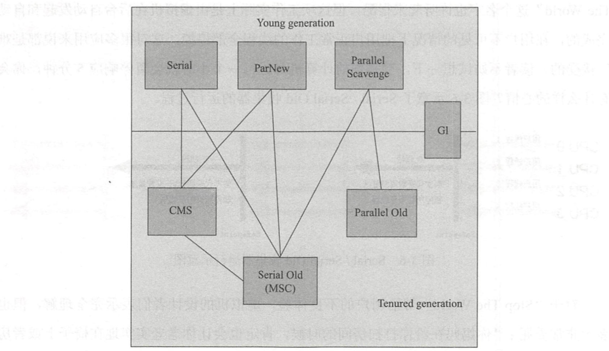
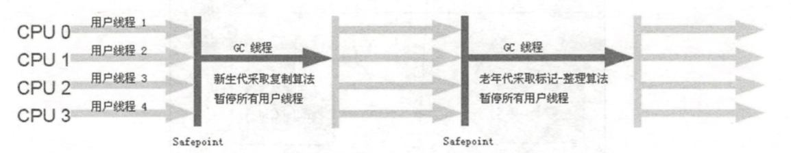
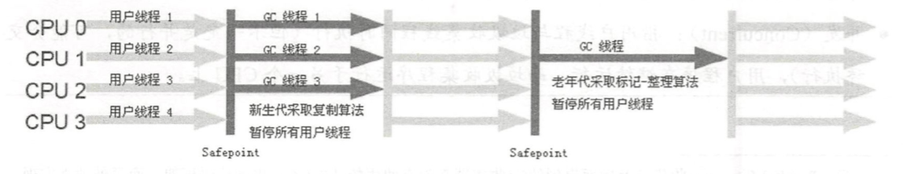
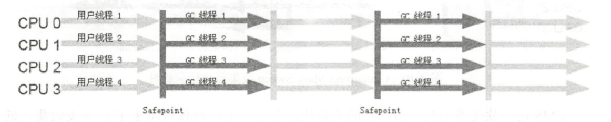
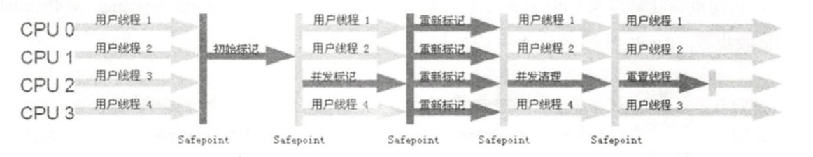

如果说收集算法是内存回收的方法论，那么垃圾收集器就是内存回收的具体实现。 Java虚拟机规范中对垃圾收集器应该如何实现并没有任何规定，因此不同的厂商、不同版本的虚拟机所提供的垃圾收集器都可能会有很大差别，并且一般都会提供参数供用户根据自己的应用特点和要求组合出各个年代所使用的收集器。这里讨论的收集器基于JDK 1.7 Update 14之后的HotSpot虚拟机(在这个版本中正式提供了商用的G1收集器，之前G1仍处于实验状态)，这个虚拟机包含的所有收集器如图所示。

### Serial收集器
Serial收集器是最基本、发展历史最悠久的收集器。这个收集器是一个单线程的收集器，但它的“单线程”的意义并不仅仅说明它只会使用一个CPU或一条收集线程去完成垃圾收集工作，更重要的是在它进行垃圾收集时，必须暂停其他所有的工作线程，直到它收集结束。“Stop The World”这个名字也许听起来很酷，但这项工作实际上是由虚拟机在后台自动发起和自动完成的，在用户不可见的情况下把用户正常工作的线程全部停掉，这对很多应用来说都是难以接受的。

下图是Serial + Serial Old收集器的运行过程。

### ParNew收集器
ParNew收集器其实就是Serial收集器的多线程版本，除了使用多条线程进行垃圾收集之外，其余行为包括Serial收集器可用的所有控制参数(例如: -XX:SurvivorRatio、 -XX:PretenureSizeThreshold、 -XX:HandlePromotionFailure等)、收集算法、Stop The World、对象分配规则、回收策略等都与Serial收集器完全一样，在实现上，这两种收集器也共用了相当多的代码。

ParNew收集器除了多线程收集之外，其他与 Serial 收集器相比并没有太多创新之处，但它却是许多运行在Server模式下的虚拟机中首选的新生代收集器，其中有一个与性能无关 但很重要的原因是，除了 Serial 收集器外，目前只有它能与 CMS 收集器配合工作。

### Parallel Scavenge收集器
Parallel Scavenge收集器是一个新生代收集器，它也是使用复制算法的收集器，也是一个并行的收集器。看上去和 ParNew 都一样，那它有什么特别之处呢?
Parallel Scavenge收集器的特点是它的关注点与其他收集器不同，CMS等收集器的关注点是尽可能地缩短垃圾收集时用户线程的停顿时间，而 Parallel Scavenge 收集器的目标则是达到一个可控制的吞吐量(Throughput)。所谓吞吐量就是 CPU 用于运行用户代码的时间与 CPU 总消耗时间的比值，即吞吐量 = 运行用户代码时间 / (运行用户代码时间+ 垃圾收集时间)，虚拟机总共运行了 100分钟，其中垃圾收集花掉1分钟，那吞吐量就是99% 。
停顿时间越短就越适合需要与用户交互的程序，良好的响应速度能提升用户体验， 而高吞吐量则可以高效率地利用 CPU 时间，尽快完成程序的运算任务，主要适合在后台运算而不需要太多交互的任务。

### Serial Old收集器
Serial Old是Serial收集器的老年代版本，它同样是一个单线程收集器，使用“标记一整理”算法。这个收集器的主要意义也是在于给 Client模式下的虚拟机使用。

### Parallel Old收集器
Parallel Old是Parallel Scavenge收集器的老年代版本，使用多线程和“标记一整理”算法。到这里，“吞吐量优先”收集器终于有了比较名副其实的应用组 合，在注重吞吐量以及CPU资源敏感的场合，都可以优先考虑 Parallel Scavenge加Parallel Old 收集器。它们的运行过程如下所示。

### CMS收集器
CMS(Concurrent Mark Sweep)收集器是一种以获取最短回收停顿时间为目标的收集器。目前很大一部分的 Java 应用集中在互联网站或者B/S系统的服务端上，这类应用尤其重视服务的响应速度，希望系统停顿时间最短，以给用户带来较好的体验。CMS 收集器就非常符合这类应用的需求。

从名字(包含“MarkSweep”)上就可以看出，CMS收集器是基于“标记一清除”算
法实现的，它的运作过程相对于前面几种收集器来说更复杂一些，整个过程分为4 个步骤，包括:
* 初始标记 (CMS initial mark)
* 并发标记 (CMS concurrent mark)
* 重新标记 (CMS remark)
* 并发清除 (CMS concurrent sweep)

其中，初始标记，重新标记这两步仍然需要Stop the world。初始标记仅仅只 是标记一下 GC Roots能直接关联到的对象，速度很快，并发标记阶段就是进行 GC Roots Tracing 的过程，而重新标记阶段则是为了修正并发标记期间因用户程序继续运作而导致标记产生变动的那一部分对象的标记记录，这个阶段的停顿时间一般会比初始标记阶段稍长一些，但远比并发标记的时间短。

由于整个过程中耗时最长的并发标记和并发清除过程收集器线程都可以与用户线程一起工作，所以，从总体上来说，CMS收集器的内存回收过程是与用户线程一起并发执行的。通过图中可以比较清楚地看到 CMS 收集器的运作步骤中并发和需要停顿的时间。

