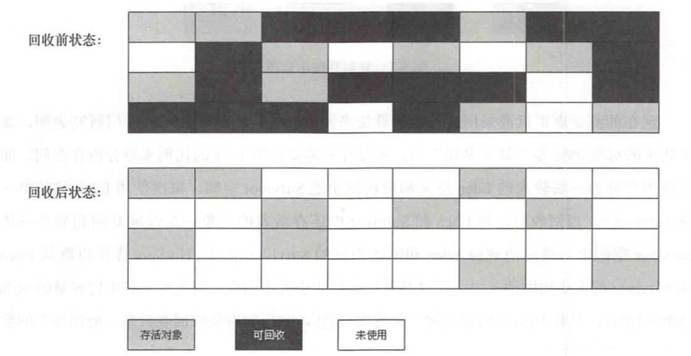
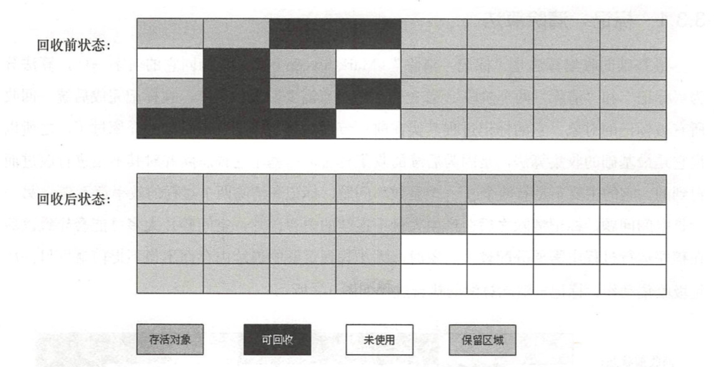
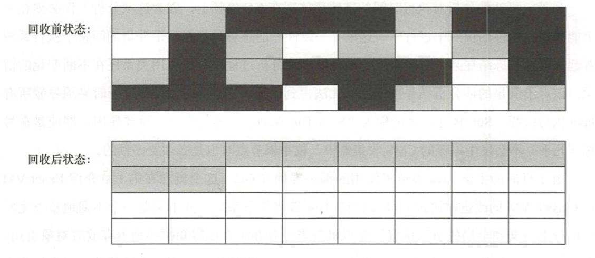

说起垃圾收集算法，不同的虚拟机实现起来可能不一样，大体上来说有三种算法思路，这里介绍一下。

### 标记-清除算法(Mark-Sweep)
基础的收集算法是“标记-清除”(Mark-Sweep)算法，如同它的名字一样，算法分 为“标记”和“清除”两个阶段: 首先标记出所有需要回收的对象，在标记完成后统一回收所有被标记的对象，它的标记过程其实在前一节讲述对象标记判定时已经介绍过了。之所以说它是最基础的收集算法，是因为后续的收集算法都是基于这种思路并对其不足进行改进而得到的。它的主要不足有两个: 一个是效率问题，标记和清除两个过程的效率都不高; 另一个是空间问题，标记清除之后会产生大量不连续的内存碎片， 空间碎片太多可能会导致以后 在程序运行过程中需要分配较大对象时，无法找到足够的连续内存而不得不提前触发另一次垃圾收集动作。

### 复制算法(Copying)
为了解决效率问题，一种称为“复制”( Copying)的收集算法出现了，它将可用内存按容量划分为大小相等的两块，每次只使用其中的一块。当这一块的内存用完了，就将还存活着的对象复制到另外一块上面，然后再把已使用过的内存空间一次清理掉。这样使得每次都是对整个半区进行内存回收，内存分配时也就不用考虑内存碎片等复杂情况，只要移动堆顶指针，按顺序分配内存即可，实现简单，运行高效。只是这种算法的代价是将内存缩小为了原来的一半，未免太高了一点。

现在的商业虚拟机都采用这种收集算法来回收新生代，IBM公司的专门研究表明，新生代中的对象 98% 是“朝生夕死”的，所以并不需要按照 1 : 1 的比例来划分内存空间，而是将内存分为一块较大的Eden空间和两块较小的Survivor空间，每次使用Eden和其中一块Survivor。当回收时，将Eden和Survivor中还存活着的对象一次性地复制到另外一块Survivor空间上，最后清理掉Eden和刚才用过的 Survivor空间。Hotspot虚拟机默认Eden和Survivor的大小比例是8 : 1，也就是每次新生代中可用内存空间为整个新生代容量 的 90% (80%+10%)，只有 10% 的内存会被“浪费”。当Survivor空间不够用时时， 需要依赖其他内存(这里指老年代)进行分配担保(Handle Promotion)。

### 标记-整理算法(Mark-Compact)
复制收集算法在对象存活率较高时就要进行较多的复制操作，效率将会变低 。更关键的是，如果不想浪费50%的空间，就需要有额外的空间进行分配担保，以应对被使用的内存中所有对象都100%存活的极端情况，所以在老年代一般不能直接选用这种算法。
根据老年代的特点，有人提出了另外一种“标记-整理”(Mark”Compact) 算法，标记过程仍然与“标记-清除”算法一样，但后续步骤不是直接对可回收对象进行清理，而是让所有存活的对象都向一端移动，然后直接清理掉端边界以外的内存。

#### 分代收集算法
当前商业虚拟机的垃圾收集都采用“分代收集”(Generational Collection)算法，这种算法并没有什么新的思想，只是根据对象存活周期的不同将内存划分为几块。一般是把Java堆分为新生代和老年代，这样就可以根据各个年代的特点采用最适当的收集算法。在新生代中，每次垃圾收集时都发现有大批对象死去，只有少量存活，那就选用复制算法，只需要付出少量存活对象的复制成本就可以完成收集。而老年代中因为对象存活率高、没有额外空间对它进行分配担保，就必须使用“标记清理”或者“标记整理”算法来进行回收。

## HotSpot算法实现
### 枚举根结点
从可达性分析中从GC Roots节点找引用链这个操作为例，可作为GC Roots的节点主要在全局性的引用(例如常量或类静态属性)与执行上下文(例如枝帧中的本地变量表)中，现在很多应用仅仅方法区就有数百兆，如果要逐个检查这里面的引用，那么必然会消耗很多时间。

另外，可达性分析对执行时间的敏感还体现在 GC 停顿上，因为这项分析工作必须在一个能确保一致性的快照中进行。这里“一致性”的意思是指在整个分析期间整个执行系统看起来就像被冻结在某个时间点上，不可以出现分析过程中对象引用关系还在不断变化的情况，该点不满足的话分析结果准确性就无法得到保证。这点是导致GC进行时必须停顿所有Java执行线程(Sun将这件事情称为Stop The World的其中一个重要原因)。

由于目前的主流Java虚拟机使用的都是准确式GC，所以当执行系统停顿下来后，并不需要一个不漏地检查完所有执行上下文和全局的引用位置，虚拟机应当是有办法直接得知哪些地方存放着对象引用。 在HotSpot的实现中，是使用一组称为 OopMap的数据结构来达到这个目的的，在类加载完成的时候， HotSpot就把对象内什么偏移量上是什么类型的数据计算出来，在JIT编译过程中，也会在特定的位置记录下楼和寄存器中哪些位置是引用。这样，GC 在扫描时就可以直接得知这些信息了。

### 安全点 SafePoint
在OopMap的协助下，HotSpot可以快速且准确地完成GC Roots枚举，但一个很现实的问题随之而来: 可能导致引用关系变化，或者说OopMap内容变化的指令非常多，如果为每一条指令都生成对应的OopMap，那将会需要大量的额外空间，这样 GC 的空间成本将会变得很高。 实际上，HotSpot也的确没有为每条指令都生成 OopMap，前面已经提到，只是在“特 定的位置”记录了这些信息，这些位置称为安全点(Safepoint)，即程序执行时并非在所有地方都能停顿下来开始GC，只有在到达安全点时才能暂停。 Safepoint的选定既不能太少以致于让 GC 等待时间太长，也不能过于频繁以致于过分增大运行时的负荷。 所以，安全点的选定基本上是以程序“是否具有让程序长时间执行的特征”为标准进行选定的一一因为每条指令执行的时间都非常短暂，程序不太可能因为指令流长度太长这个原因而过长时间运行，“长时间执行”的最明显特征就是指令序列复用，例如方法调用、循环跳转、异常跳转等，所以具有这些功能的指令才会产生Safepoint。

### 安全区域 SafeRegion
使用Safepoint似乎已经完美地解决了如何进入GC的问题，但实际情况却并不 一定。 Safepoint机制保证了程序执行时，在不太长的时间内就会遇到可进入GC 的Safepoint。 但是，程序“不执行”的时候呢? 所谓的程序不执行就是没有分配CPU时间，典型的例子就是线程处于Sleep状态或者Blocked状态，这时候线程无法响应JVM的中断请求，“走”到安全的地方去中断挂起，JVM也显然不太可能等待线程重新被分配 CPU 时间。对于这种情况，就需要安全区域(Safe Region)来解决。

安全区域是指在一段代码片段之中，引用关系不会发生变化。在这个区域中的任意地方开始GC都是安全的。我们也可以把Safe Region看做是被扩展了的Safepoint。

在线程执行到Safe Region中的代码时，首先标识自己已经进入了Safe Region，那样，当在这段时间里JVM要发起GC时，就不用管标识自己为Safe Region状态的线程了。在线程要离开Safe Region 时，它要检查系统是否已经完成了根节点枚举(或者是整个 GC 过程)，如果完成了，那线程就继续执行，否则它就必须等待直到收到可以安全离开Safe Region的信号为止。

## 小结
此文介绍了垃圾回收相关的算法，以及Hotspot虚拟机如何实现垃圾收集的一些关键点。理解了它们之后，接下来将详细介绍具体的应用，也就是各种垃圾收集器，以及它们是如何根据这些原理进行操作的。

