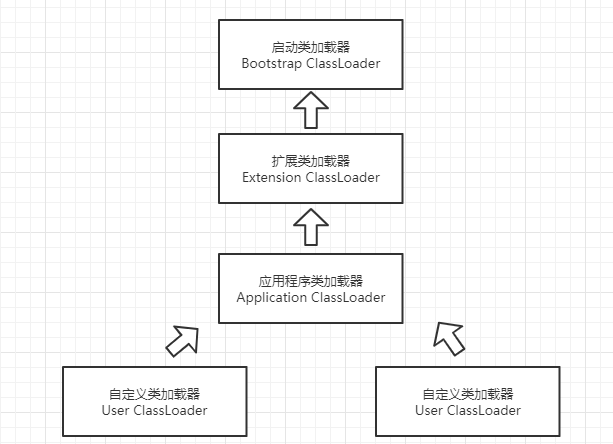

## 类加载器 ClassLoader
虚拟机设计团队把类加载阶段中的“通过一个类的全限定名来获取描述此类的二进制字节流”这个动作放到虚拟机外部去实现，以便让应用程序自己决定如何去获取所需要的类。实现这个动作的代码模块称为“类加载器”。

对于任意一个类，都需要由它的类加载器和这个类本身一同确立其在Java虚拟机中的唯一性，每一个类加载器，都有一个独立的类名称空间。如果两个类由不同的类加载器加载，即使它们都来源于同一个Class文件，被同一个虚拟机加载，最终这两个类也不相等。

## 双亲委派模型
从Java虚拟机的角度来讲，只存在两种不同的类加载器: 一种是启动类加载器（Bootstrap ClassLoader），这个类加载器使用C++语言实现，是虚拟机自身的一部分。另一种就是所有其他类的加载器，这些类加载器都有Java语言实现，独立于虚拟机外部，全部继承子抽象类java.lang.ClassLoader.

从Java开发人员的角度看，类加载器还可以划分的更细致一些，绝大部分Java程序都会使用到下面3种系统提供的类加载器：

1. 启动类加载器 （Bootstrap ClassLoader）。负责加载存放在<Java_HOME>\lib 中的类库。启动类加载器无法被Java程序直接引用。

2. 扩展类加载器（Extension ClassLoader）。负责加载<JAVA_HOME>\lib\ext 中的类库，开发者可以直接使用Java程序直接访问。

3. 应用程序类加载器（Application ClassLoader）。这个类加载器是ClassLoader中的getSystemClassLoader()方法的返回值，所以一般也称它为系统类加载器。它复杂加载用户类路径(ClassPath)上所指定的类库，开发者可以直接使用这个类加载器。如果应用程序中没有自定义过自己的类加载器，一般情况下这个就是程序中默认的类加载器。

我们的应用程序都是由这3个类加载器互相配合进行加载的，如有必要，可以加入自己定义的类加载器。它们的关系一般如图所示：

图中所展示的关系成为类加载器的双亲委派模型(Parents Delegation Model)。双亲委派模型的工作过程是，如果一个类加载器收到了类加载请求，它首先不会自己去尝试加载这个类，而是会委托给父类加载器去完成，每一个层次的类加载器都是如此。因此所有的加载请求最终都应该传送到顶层的启动类加载器中。只有当父加载器无法完成这个加载请求时，子加载器才会尝试自己去加载。

使用双亲委派机制有一个好处是，Java类随着它的类加载器一起具备了一种带有优先级的层次关系。例如类java.lang.Object，无论哪一个类加载器要加载这一个类，最终都是委派给模型最顶端的启动类加载器进行加载，因此Object类在各个环境中加载的都是同一个类。

## 破坏双亲委派模型
双亲委派模型并不是一个强制性的约束模型，有时候也需要打破它。这个模型自身也存在一定的缺陷。双亲委派模型能很好的解决了各个类加载器的基础类统一的问题，但是如果基础类又需要调回用户的代码，这个时候双亲委派模型就不能做到了。

一个典型的例子就是JNDI服务，它的代码由启动类加载器加载，但JNDI的目的就是对资源进行集中管理和查找，它需要调用由独立厂商实现并部署在应用程序的ClassPath下的JNDI接口提供者(SPI, Service Provider Interface)的代码。但启动类加载器无法找到这些代码。

因此Java设计团队引入了一个不太优雅的设计：线程上下文类加载器(Thread Context ClassLoader)。有了这个类加载器，JNDI服务可以使用它去加载所需要的SPI代码，也就是父类加载器请求子类加载器去完成类加载的动作，实际上打破了双亲委派模型。
