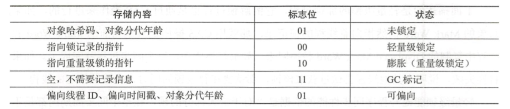

高效并发是从JDK1.5到JDK1.6的一个重要改进， HotSpot虚拟机开发团队在这个版本上花费了大量的精力去实现各种锁优化技术，如适应性自旋(Adaptive Spinning)、锁消除(Lock Elimination)、锁粗化(Lock Coarsening)、轻量级锁(Lightweight Locking)和偏向锁(Biased Locking)等，这些技术都是为了在线程之间更高效地共享数据，以及解决竞争问题，从而提高程序的执行效率。

### 自旋锁与自适应自旋
虚拟机的开发团队也注意到在许多应用上，共享数据的锁定状态只会持续很短的一段时间，为了这段时间去挂起和恢复线程并不值得。如果物理机器有一个以上的处理器，能让两个或以上的线程同时并行执行，我们就可以让后面请求锁的那个线程“稍等一下”，但不放弃处理器的执行时间，看看持有锁的线程是否很快就会释放 锁。为了让线程等待，我们只需让线程执行一个忙循环(自旋)，这项技术就是所谓的自旋锁。

自旋等待不能代替阻塞，且先不说对处理器数量的要求，自旋等待本身虽然避免了线程切换的开销，但它是要占用处理器时间的。因此，如果锁被占用的时间很短，自旋等待的效果就会非常好，反之，如果锁被占用的时间很长，那么自旋的线程只会白白消耗处理器资源，而不会做任何有用的工作，反而会带来性能上的浪费 。 因此，自旋等待的时间必须要有一定的限度，如果自旋超过了限定的次数仍然没有成功获得锁，就应当使用传统的方式去挂起线程了。自旋次数的默认值是 10次。

在JDK 1.6 中引入了自适应的自旋锁。自适应意味着自旋的时间不再固定了，而是由前一次在同一个锁上的自旋时间及锁的拥有者的状态来决定。如果在同一个锁对象上，自旋等待刚刚成功获得过锁，并且持有锁的线程正在运行中，那么虚拟机就会认为这次自旋也很有可能再次成功，进而它将允许自旋等待持续相对更长的时间，比如100个循环。另外，如果对于某个锁，自旋很少成功获得过，那在以后要获取这个锁时将可能省略掉自旋过程，以避免浪费处理器资源。

### 轻量级锁
轻量级锁是JDK 1.6之中加入的新型锁机制，它名字中的“轻量级”是相对于使用操作系统互斥量来实现的传统锁而言的，因此传统的锁机制就称为“重量级”锁。首先需要强调一点的是，轻量级锁并不是用来代替重量级锁的，它的本意是在没有多线程竞争的前提下， 减少传统的重量级锁使用操作系统互斥量产生的性能消耗。

要理解轻量级锁，以及后面会讲到的偏向锁的原理和运作过程，必须从HotSpot虚拟机的对象(对象头部分〉的内存布局开始介绍。Hotspot虚拟机的对象头 (Object Header)分为两部分信息，第一部分用于存储对象自身的运行时数据，如哈希码(HashCode)、 GC分代年龄(Generational GC Age)等，这部分数据的长度在32位和64位的虚拟机中分别为32bit和64bit，官方称它为“Mark Word"，它是实现轻量级锁和偏向锁的关键。

例如，在32位的Hotspot虚拟机中对象未被锁定的状态下，Mark Word的32bit空间中的25bit用于存储对象哈希码( HashCode), 4bit用于存储对象分代年龄，2bit用于存储锁标志位，1bit固定为0，在其他状态(轻量级锁定、重量级锁定、GC标记、可偏向)下对象的存储内容见下表。 

轻量级锁的执行过程如下。在代码进入同步块的时候，如果此同步对象没有被锁定(锁标志位为“01”状态)，虚拟机首先将在当前线程的技帧中建立一个名为锁记录(Lock Record)的空间，用于存储锁对象目前的Mark Word的拷贝。

然后，虚拟机将使用CAS操作尝试将对象的Mark Word更新为指向Lock Record 的指针。如果这个更新动作成功了，那么这个线程就拥有了该对象的锁，并且对象 Mark Word的锁标志位(MarkWord的最后 2bit)将转变为“00”，即表示此对象处于轻量级锁定状态。

如果这个更新操作失败了，虚拟机首先会检查对象的Mark Word是否指向当前线程的栈帧，如果只说明当前线程已经拥有了这个对象的锁，那就可以直接进入同步块继续执行，否则说明这个锁对象已经被其他线程抢占了。如果有两条以上的线程争用同一个锁，那轻量级 锁就不再有效，要膨胀为重量级锁，锁标志的状态值变为“10”， Mark Word中存储的就是指向重量级锁(互斥量)的指针，后面等待锁的线程也要进入阻塞状态。

轻量级锁能提升程序同步性能的依据是“对于绝大部分的锁，在整个同步周期内都是不存在竞争的”，这是一个经验数据。如果没有竞争，轻量级锁使用CAS操作避免了使用互斥量的开销，但如果存在锁竞争，除了互斥量的开销外，还额外发生了CAS操作，因此在有竞争的情况下，轻量级锁会比传统的重量级锁更慢。

### 偏向锁
偏向锁也是JDK1.6中引入的一项锁优化，它的目的是消除数据在无竞争情况下的同步原语，进一步提高程序的运行性能。如果说轻量级锁是在无竞争的情况下使用 CAS操作去消除同步使用的互斥量，那偏向锁就是在无竞争的情况下把整个同步都消除掉，连CAS操作都不做了。

偏向锁的意思是这个锁会偏向于第一个获得它的线程，如果在接下来的执行过程中，该锁没有被其他的线程获取，则持有偏向锁的线程将永远不需要再进行同步。

假设当前虚拟机启用了偏向锁(启用参数 -XX:+UseBiasedLocking)。那么，当锁对象第一次被线程获取的时候，虚拟机将会把对象头中的标志位设为“01”，即偏向模式。同时使用 CAS 操作把获取到这个锁的线程的ID记录在对象的Mark Word之中，如果 CAS 操作成功，持有偏向锁的线程以后每次进入这个锁相关的同步块时，虚拟机都可以不再进行任何同步操作。

当有另外一个线程去尝试获取这个锁时，偏向模式就宣告结束。根据锁对象目前是否处于被锁定的状态，撤销偏向(Revoke Bias)后恢复到未锁定(标志位为“01”)或轻量级锁定(标志位为“00”)的状态，后续的同步操作就如上面介绍的轻量级锁那样执行。

偏向锁可以提高带有同步但无竞争的程序性能。它同样是一个带有效益权衡(Trade Off)性质的优化，也就是说，它并不一定总是对程序运行有利，如果程序中大多数的锁总是被多个不同的线程访问，那偏向模式就是多余的。在具体问题具体分析的前提下，有时候使用参数-XX:-UseBiasedLocking来禁止偏向锁优化反而可以提升性能。

### 锁消除
锁消除是指虚拟机即时编译器在运行时，对一些代码上要求同步，但是被检测到不可能存在共享数据竞争的锁进行消除。锁消除的主要判定依据来源于逃逸分析的数据支持，如果判断在一段代码中，堆上的所有数据都不会逃逸出去从而被其他线程访问到，那就可以把它们当做栈上数据对待，认为它们是线程私有的，同步加锁自然就无须进行。

### 锁粗化
原则上，我们在编写代码的时候，总是推荐将同步块的作用范围限制得尽量小，只在共享数据的实际作用域中才进行同步，这样是为了使得需要同步的操作数量尽可能变小，如果存在锁竞争，那等待锁的线程也能尽快拿到锁。
大部分情况下，上面的原则都是正确的，但是如果一系列的连续操作都对同一个对象反复加锁和解锁，甚至加锁操作是出现在循环体中的，那即使没有线程竞争，频繁地进行互斥同步操作也会导致不必要的性能损耗。如果虚拟机探测到有这样一串 零碎的操作都对同一个对象加锁，将会把加锁同步的范围扩展(粗化)到整个操作序列的外部。
