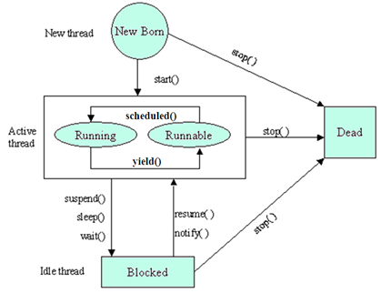

#### Java多线程 基础
想当初上大学时，最开始的计算机入门课是用Java语言教学的，也就是说，人生的第一行"Hello World"程序是用Java写的。可惜到现在在组里写Web项目，Java写的少了。想借着这个机会把Java相关的东西再捡一些起来，顺便回顾一下并行、并发等一些知识。

##### 线程
在计算机世界里，当我们探讨并行的时候，实际上是指一系列的任务在计算机中同时运行。对计算机来说，每一个任务就是一个进程(process), 在每一个进程内部至少有一个线程(thread)在运行中。

线程是程序执行的一个路径，每一个线程都有自己的局部变量表、程序计数器(指向正在执行的指令指针)以及各自的生命周期。

##### 如何创建线程
1. 继承Thead类，重写run()方法。
```
class MyThread extends Thread { ... }
new MyThread().start();
```
2. 实现Runnable接口，重写run()方法。
```
class MyRun implements Runnable {...}
new Thread(new MyRun()).start();
```

##### 线程的生命周期
当线程被创建并启动以后，它既不是一启动就进入了执行状态，也不是一直处于执行状态。在线程的生命周期中，它要经过新建(New)、就绪（Runnable）、运行（Running）、阻塞(Blocked)和死亡(Dead)5种状态。尤其是当线程启动以后，它不可能一直霸占着CPU独自运行，所以CPU需要在多条线程之间切换，于是线程状态也会多次在运行、阻塞之间切换

1. 新建状态，当程序使用new关键字创建了一个线程之后，该线程就处于新建状态，此时仅由JVM为其分配内存，并初始化其成员变量的值。

2. 就绪状态，当线程对象调用了start()方法之后，该线程处于就绪状态。Java虚拟机会为其创建方法调用栈和程序计数器，等待调度运行。

3. 运行状态，如果处于就绪状态的线程获得了CPU，开始执行run()方法的线程执行体，则该线程处于运行状态。

4. 阻塞状态，当处于运行状态的线程失去所占用资源之后，便进入阻塞状态。

下面是在线程的生命周期当中，线程的各种状态的转换过程。


##### 守护线程（daemon）
守护线程是一类特殊的线程，一般用于后台的工作，比如JDK垃圾回收线程。可通过setDeamon() 方法设置。

##### Thread API
通常我们使用的与线程相关的API有:
1. sleep()。休息一段时间。建议使用TimeUnit来替代Thread.sleeo()
2. yield()。yield方法属于一种启发式方法，其会提醒调度器我愿意放弃当前的CPU资源，如果CPU资源不紧张，则会忽略这种提醒。
3. interrupt(). 中断方法，能够打断线程的阻塞。
4. join()。join某个线程A，会是的当前线程B进入等待，直到线程A结束生命周期，或者达到给定的时间。在此期间线程B是处于BLOCKED状态。

具体使用方法及细节可参照官方文档。

##### 小结
现在开发中几乎不需要自己去细节操作Thread了，但是重温一下这些基础知识也是不错的，温故而知新。